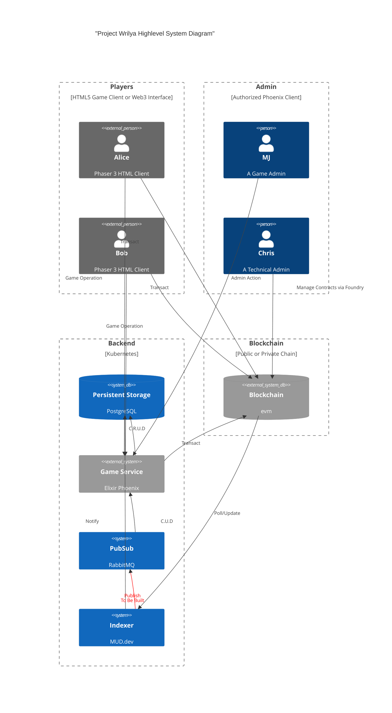

# Architecture

This document will review some of the high level architecture designs implemented in Wrilya.

## Design

```mermaid
C4Context
    title "Project Wrilya Highlevel System Diagram"
    UpdateLayoutConfig($c4ShapeInRow="2")

    Boundary(playersBoundary, "Players", "HTML5 Game Client or Web3 Interface"){
        Person_Ext(playerAlice, "Alice", "Phaser 3 HTML Client")
        Person_Ext(playerBob, "Bob", "Phaser 3 HTML Client")
    }
    Boundary(adminBoundary, "Admin", "Authorized Phoenix Client"){
        Person(adminMJ, "MJ", "A Game Admin")
        Person(adminChris, "Chris", "A Technical Admin")
    }
    Boundary(backend, "Backend", "Kubernetes"){
        SystemDb(BackendDB, "Persistent Storage", "PostgreSQL")
        System_Ext(BackendService, "Game Service", "Elixir Phoenix")
        System(BackendPubSub, "PubSub", "RabbitMQ")
        System(BackendIndexer, "Indexer", "MUD.dev")

    }
    Boundary(blockchain, "Blockchain", "Public or Private Chain"){
        SystemDb_Ext(Blockchain, "Blockchain", "evm")
    }

    %% Player Alice Relationships
    Rel(playerAlice, Blockchain, "Transact")
    UpdateRelStyle(playerAlice, Blockchain, $offsetY="-95", $offsetX="-200")
    Rel(playerAlice, BackendService, "Game Operation")
    UpdateRelStyle(playerAlice, BackendService, $offsetY="-100", $offsetX="-150")

    %% Player Bob Relationships
    Rel(playerBob, Blockchain, "Transact")
    UpdateRelStyle(playerBob, Blockchain,$offsetY="-100", $offsetX="-130")
    Rel(playerBob, BackendService, "Game Operation")
    UpdateRelStyle(playerBob, BackendService, $offsetY="-100", $offsetX="-50")

    %% Admin Relationships
    Rel(adminChris, Blockchain, "Manage Contracts via Foundry")
    UpdateRelStyle(adminChris, Blockchain, $offsetY="-100", $offsetX="60")
    Rel(adminMJ, BackendService, "Admin Action")
    UpdateRelStyle(adminMJ, BackendService, $offsetY="-100", $offsetX="90")

    %% Blockchain Relationships
    Rel(Blockchain, BackendIndexer, "Poll/Update")
    UpdateRelStyle(Blockchain, BackendIndexer, $offsetY="0", $offsetX="40")

    %% Backend Indexer Relationships
    Rel(BackendIndexer, BackendDB, "C.U.D")
    UpdateRelStyle(BackendIndexer, BackendDB, $offsetY="20", $offsetX="90")
    Rel(BackendIndexer, BackendPubSub, "Publish <br>To Be Built")
    UpdateRelStyle(BackendIndexer, BackendPubSub, $lineColor="red", $textColor="red", $offsetY="20", $offsetX="-30")

    %% Backend Pubsub Relationships
    Rel(BackendPubSub, BackendService, "Notify")
    UpdateRelStyle(BackendPubSub, BackendService, $offsetY="20", $offsetX="-120")

    %% Backend Service Relationships
    Rel(BackendService, BackendDB, "C.R.U.D")
    UpdateRelStyle(BackendService, BackendDB, $offsetY="-20", $offsetX="-10")
    Rel(BackendService, Blockchain, "Transact")
    UpdateRelStyle(BackendService, Blockchain, $offsetY="10", $offsetX="-60")
```
